# Hi there, I'm Shaik Rameez Basha! 👋

  

---

### 🔴 01 // SYSTEM FOCUS MATRIX

| 🌐 FULL-STACK CORE | 🧠 AI INFERENCE | ⚙️ DEV COMPILERS |
| :--- | :--- | :--- |
| Building modern React layers, FastAPI workers, and relation schemas. | Mapping explainable deep learning features and datasets paths. | Traversing Python AST structures and captures compiler standard stdout. |
| `React` &bull; `TypeScript` &bull; `SQL` | `PyTorch` &bull; `Explainable AI` | `AST Nodes` &bull; `Runtimes` |

---

### 🔴 02 // ARSENAL TELEMETRY (SKILLS MATRIX)

  

---

### 🔴 03 // FEATURED MISSION REGISTRY (INTERACTIVE DOSSIERS)

> [!TIP]
> Click on the project node headers below to expand their technical dossiers.

  
<b>[▶] SELECT MODULE // M-01 // CODEORIGIN (AST AUDITOR)</b>

   
  <blockquote>
    <strong>Operational Status: ACTIVE // Repository: <a href="https://github.com/Basharameez/codeorigin" target="_blank">Basharameez/codeorigin</a></strong>
    
Runs non-execution static analyses on target repositories to map syntax trees, trace class inheritances, check license compliance, and audit security vectors without compilation requirements.

    <em>Hardware Stack: FastAPI &bull; Python AST &bull; React &bull; TypeScript &bull; SQLite</em>
  </blockquote>

  
<b>[▶] SELECT MODULE // M-02 // PYTHON_WEB_COMPILER (RUNTIMES)</b>

   
  <blockquote>
    <strong>Operational Status: DEPLOYED // Repository: <a href="https://github.com/Basharameez/python_web_compiler" target="_blank">Basharameez/python_web_compiler</a></strong>
    
Compiles user-submitted Python payloads inside Flask threads, capturing stdout channels to export active matplotlib coordinate logs as HTML image objects.

    <em>Hardware Stack: Python &bull; Flask Runtimes &bull; Matplotlib &bull; HTML5 Console</em>
  </blockquote>

  
<b>[▶] SELECT MODULE // M-03 // STUDENT_INFO_PORTAL (INGEST)</b>

   
  <blockquote>
    <strong>Operational Status: DECOMMISSIONED // Repository: <a href="https://github.com/Basharameez/student-info-portal" target="_blank">Basharameez/student-info-portal</a></strong>
    
Processes student records, parses spreadsheets, indexes schema columns, and executes multi-criteria queries inside browser environments.

    <em>Hardware Stack: HTML5 &bull; CSS3 &bull; JavaScript &bull; SheetJS Ingestion</em>
  </blockquote>

  
<b>[▶] SELECT MODULE // M-04 // INTEL_3 (AI DATALAB)</b>

   
  <blockquote>
    <strong>Operational Status: ARCHIVED // Repository: <a href="https://github.com/Basharameez/INTEL_3" target="_blank">Basharameez/INTEL_3</a></strong>
    
Adaptive personal tutor database prototype mapping user progress scores to SQLite relational schemas inside Jupyter environments.

    <em>Hardware Stack: SQLite &bull; Jupyter Notebooks &bull; Ipywidgets</em>
  </blockquote>

---

### 🔴 04 // DEPLOYMENT CHRONOLOGY

#### Full-Stack Systems Engineer — AfterQuery
##### DEPLOYED REMOTE | 2026
*   Configured repository static analysis hooks, AST traversals, FastAPI endpoints, and modular datagrids.
*   Employed async workers to audit source code components structures.
*   Conducted architectural analysis on codebase systems to ensure compliance with technical specifications.

#### Data Ingestion & Widgets — RotorDyn
##### RADIAL TELEMETRY PROJECT | PROPRIETARY
*   Engineered data ingestion pipelines and custom visualization widgets to process rotating machinery vibration telemetry.
*   Developed responsive desktop interface components using PySide6 and Plotly.js.

---

### 🔴 05 // COMPLIANCE CERTIFICATION

#### B.Tech Production Cycle // NEC CSE-AI JNTUK
*   Calibration verified across neural networks, compiler stages, and statistical models.
*   Chronology Node: **2022 &ndash; 2026** &bull; Score Metric: **CGPA 7.79 / 10**

#### Explainable AI (XAI) QA Publication
*   Published in **IEEE Xplore** in **2026**.
*   *Focus*: Tracing gradient activation layers and mapping features interpretability inside active neural matrices.

---

### 🌐 CONNECT SIGNAL

  
  

